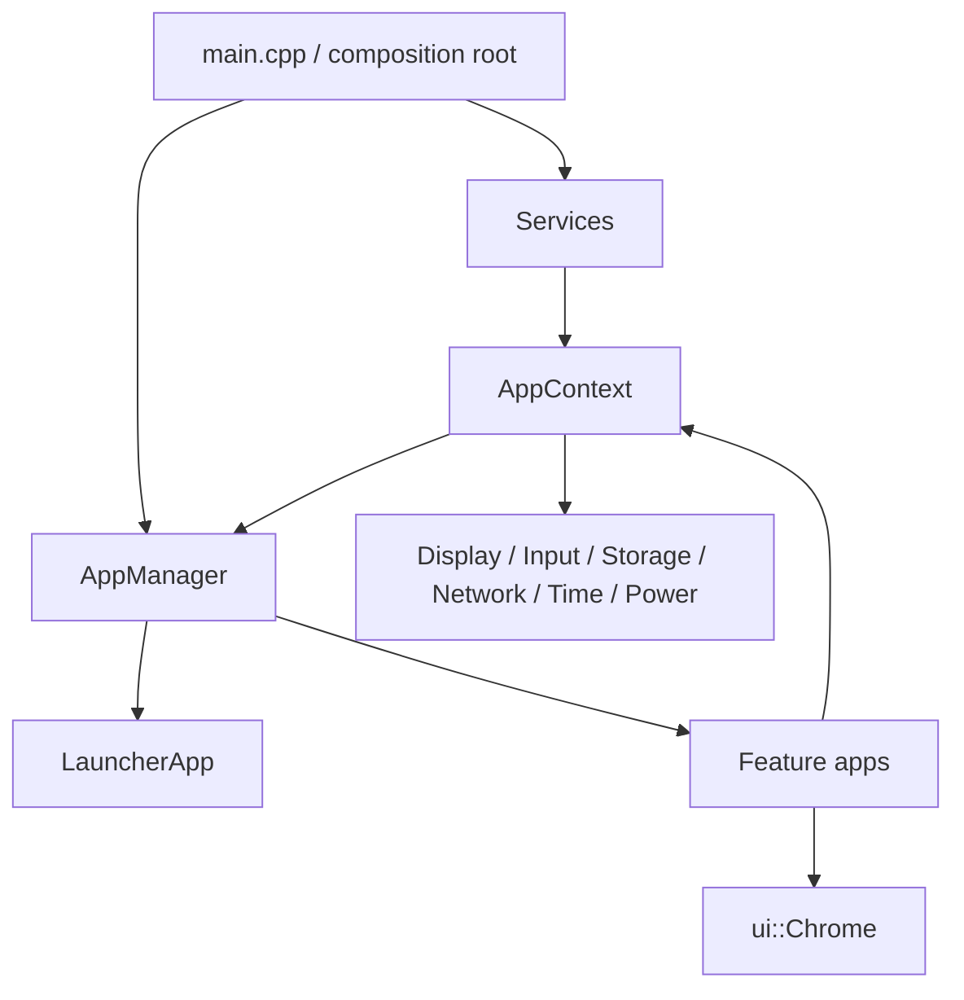

# Paper OS architecture and maintenance guide

This document is the working agreement for Paper OS. Its purpose is to keep
the firmware understandable as it grows from a launcher into a collection of
heavy e-paper applications.

## 1. Design in one sentence

Paper OS is a **modular monolith**: one firmware image, one owner of each
hardware resource, and many independently structured applications with a
common lifecycle and common chrome.

The .NET analogy is a single ASP.NET host with feature modules. `main.cpp` is
the composition root, `Services` is a small dependency-injection container,
and every `IApp` is analogous to a page/view-model feature with a defined
activation and disposal lifecycle.

Why a monolith instead of separate binaries:

- Only one application can safely own the e-paper display, touch controller,
  SD card, Wi-Fi stack, RTC, and power manager at a time.
- Switching apps is instant and does not reboot the device.
- Shared code—Wi-Fi configuration, time, battery status, navigation, fonts,
  SD mounting—is implemented once.
- The firmware still compiles to one ESP32-S3 image, which is the natural unit
  of deployment on this device.

## 2. Current source tree

```text
Paper OS/
├── platformio.ini                 PlatformIO build settings
├── partitions.csv                 OTA and internal-storage layout
├── include/
│   ├── app/                       IApp, AppContext, AppManager contracts
│   ├── apps/
│   │   ├── launcher/              Launcher public interface
│   │   ├── notes/                 Notes public interface
│   │   ├── pomodoro/              Pomodoro public interface
│   │   ├── settings/              Settings public interface
│   │   ├── weather/               Weather public interface and models
│   │   └── native/                reusable StatusApp placeholder interface
│   ├── config/                    non-secret defaults and location constants
│   ├── services/                  native-service public interfaces
│   └── ui/                        shared Chrome header/footer interface
├── src/
│   ├── main.cpp                   composition root; no feature logic
│   ├── app/                       AppManager implementation
│   ├── apps/                      one directory per application
│   ├── integrations/              third-party protocol adapters
│   ├── platform/                  device-level capabilities
│   │   ├── display/               display initialization
│   │   ├── input/                 touch/button polling
│   │   ├── network/               Wi-Fi and setup portal
│   │   ├── power/                 battery and sleep policy
│   │   ├── storage/               microSD ownership
│   │   ├── tasks/                 FreeRTOS task ownership
│   │   └── time/                  RTC/NTP synchronization
│   ├── services/                  service composition only
│   └── ui/                        common visual components
├── assets/                        retained optional assets and licenses
└── docs/                          maintainer documentation
```

The disabled `src/apps/legacy/Apps.cpp.disabled` file is migration history only.
It must not be re-enabled or used as a template for new work.

## 3. Runtime architecture



### `main.cpp`: composition root

`main.cpp` creates long-lived services and app instances, registers the apps,
and runs the host loop. It should contain no screen drawing, parsing, HTTP,
SD-file logic, or feature decisions.

This is similar to `Program.cs` in a .NET application: registrations belong
here; business behavior does not.

### `Services`: the hardware boundary

`Services` constructs an `AppContext`, which holds references to services. An
app receives the context when it starts; it must use services instead of
initializing hardware itself.

| Service | Owns | Apps must not do |
|---|---|---|
| `DisplayService` | PaperS3 display startup/reset | call a second display `begin()` |
| `InputService` | one `M5.update()` per loop | poll/init touch independently |
| `StorageService` | SD mount/unmount and future USB handoff | call `SD.begin()` or `SPI.begin()` |
| `NetworkService` | saved Wi-Fi, AP provisioning, HTTP portal | start a competing AP/server |
| `TimeService` | NTP and local formatting | configure a second NTP client |
| `PowerService` | battery state and global power policy | put the whole OS into deep sleep |
| `TaskRegistry` | future worker ownership/cancellation | leave worker tasks running on exit |

### `AppManager`: navigation and cleanup

The app manager owns switching. When it changes app it:

1. Asks the active app to stop.
2. Stops the active app's registered workers.
3. Resets display state.
4. Calls `onStart()` for the next app.

That is the embedded equivalent of disposing a navigation scope, then creating
the next page scope. App code must never call another app directly. It asks the
navigator to activate an `AppId` instead.

## 4. Application contract

Every real application implements `IApp`:

```cpp
class IApp {
 public:
  virtual AppId id() const = 0;
  virtual const char* title() const = 0;
  virtual bool onStart(AppContext&) = 0;
  virtual void onTick(AppContext&, uint32_t nowMs) = 0;
  virtual void onStop(AppContext&) = 0;
};
```

### Lifecycle rules

`onStart`

- Allocate only what the app needs.
- Draw the initial page.
- Start app-owned asynchronous work if necessary.
- Return `false` if startup cannot safely continue.

`onTick`

- Must return quickly; it runs from the main UI loop.
- Handle a touch event, consume completed worker results, or make a small
  display update.
- Never use long `delay()` calls, network requests, or a long file scan here.

`onStop`

- Close files and sockets.
- Release large PSRAM buffers and LVGL objects.
- Request that app-owned workers stop.
- Do not deinitialize global display, SD, Wi-Fi, or time services.

### `StatusApp`

`StatusApp` is a temporary placeholder for apps not ported yet. It is suitable
for prototypes, but a serious application gets a real folder, header, model,
renderer, and controller.

## 5. Creating or importing an app

Create this structure first:

```text
include/apps/my_app/MyApp.h
src/apps/my_app/MyApp.cpp
src/apps/my_app/README.md
```

Use this starting point:

```cpp
// include/apps/my_app/MyApp.h
#pragma once
#include "app/IApp.h"
#include "apps/native/StatusApp.h"  // NavigationCallback

class MyApp final : public IApp {
 public:
  void setNavigator(NavigationCallback value) { navigator_ = value; }
  AppId id() const override { return AppId::MyApp; }
  const char* title() const override { return "My App"; }
  bool onStart(AppContext&) override;
  void onTick(AppContext&, uint32_t) override;
  void onStop(AppContext&) override;
 private:
  void draw(AppContext&);
  NavigationCallback navigator_{nullptr};
};
```

Then:

1. Add an `AppId` in `include/app/IApp.h`.
2. Include the app header and create one instance in `src/main.cpp`.
3. Register it with `manager.registerApp(...)`.
4. Give it the shared `navigateTo` callback.
5. Add a launcher tile in `LauncherApp.cpp`.
6. Draw shared chrome in every view.
7. Add a `PORTING.md` with upstream link, license, and modifications if this
   is derived from another repository.

### Importing a standalone repository

Do not copy its `setup()`, `loop()`, board configuration, partitions, or full
`platformio.ini` into this project. Those are application-host responsibilities.

Instead, classify source files:

| Upstream code | Destination / action |
|---|---|
| Pure domain/parser code | app or `integrations/` module |
| Rendering code | app renderer, adapted to `ui::Chrome` content area |
| `setup()` | distribute initialization to services and `onStart()` |
| `loop()` | distribute quick work to `onTick()` or a background task |
| Wi-Fi portal | replace with `NetworkService` |
| SD initialization | replace with `StorageService` |
| deep sleep | move to global power policy or an app lock screen |
| fonts/icons/assets | import only after license review; document origin |

The Pomodoro and Weather ports are examples. Their upstream behavior is
preserved, but their ownership of the host loop and hardware has been removed.

## 6. Shared UI: header, footer, and content area

All production screens use `ui::Chrome`.

```cpp
M5.Display.clear();
ui::Chrome::drawHeader(context, "My App");
ui::Chrome::drawFooter();
// Draw app content after the header and before the footer.
```

The fixed regions are:

| Region | Pixel range | Purpose |
|---|---:|---|
| Header | `y = 0..67` | Back action, title, time, Wi-Fi, battery |
| Content | `y = 68..885` | Owned exclusively by the active app |
| Footer | `y = 886..959` | Back, Home, optional Previous/Next |

The default footer has Back and Home. A paged app can opt into page navigation:

```cpp
ui::ChromeOptions chrome;
chrome.showPrevious = page > 0;
chrome.showNext = page < lastPage;
ui::Chrome::drawFooter(chrome);

const auto action = ui::Chrome::hitTestFooter(touch.x, touch.y, chrome);
```

Use one handler for header and footer navigation. The header Back and footer
Back/Home should always be reliable and should not be hidden by application
content.

## 7. UI change rules

### E-paper refresh discipline

E-paper is not an LCD. A full refresh is visible, comparatively slow, and
costs power. Avoid redraws in every loop iteration.

- Draw once in `onStart()`.
- Redraw on a meaningful touch, model change, or scheduled refresh.
- Use small partial changes for clocks/timers when verified on hardware.
- Schedule a full anti-ghosting refresh after a number of partial changes.
- Do not animate at 30/60 FPS; represent progress with discrete changes.

### Layout and spacing

Use a small layout scale rather than random values:

```cpp
constexpr int kScreenWidth = 540;
constexpr int kScreenHeight = 960;
constexpr int kOuterMargin = 18;
constexpr int kSmallGap = 8;
constexpr int kGap = 16;
constexpr int kLargeGap = 24;
```

Rules:

- Leave 16–24 px around cards and screen edges.
- Use the same gap for repeated cards in a grid.
- Do not draw inside the header/footer regions.
- Make touch targets at least about 48×48 px; 70–100 px is better for an
  e-paper touchscreen.
- Test at the PaperS3 portrait resolution, 540×960, not an arbitrary desktop
  preview size.
- Prefer two lines of small text over truncating a long location/address.

### Icons

The launcher currently uses simple geometry icons. This is deliberate: they
are compact, monochrome, render fast, and do not depend on a font containing a
particular Unicode glyph.

When importing icon assets:

1. Check the asset license.
2. Store source files under `assets/` or the app folder, not inside unrelated
   C++ files.
3. Convert images to a suitable 1-bit/4-bit grayscale format and test them at
   actual display scale.
4. Keep transparent background behavior explicit; e-paper does not hide
   artifacts as an LCD does.
5. Do not use emoji as UI icons—glyph availability differs by font.

### Fonts

The system should choose fonts centrally, then apps consume named styles.
Until a `TypographyService` is introduced, follow these rules:

- Use M5GFX built-in fonts for small UI labels and system chrome.
- Use a tested VLW/bitmap font for reading content and large Unicode coverage.
- Load large ebook fonts only while the reader is active; place their cache in
  PSRAM and release it in `EpubApp::onStop()`.
- Keep all text that must be searchable/debuggable as UTF-8 source, but test
  RTL, Hindi, and non-Latin text on the device.
- A font-size setting must alter actual rendering metrics and reflow text; it
  is not merely a saved preference.

## 8. Memory and FreeRTOS guidance

PaperS3 has 8 MB PSRAM plus scarce internal memory.

Use PSRAM for large display buffers, decoded images, font caches, EPUB page
layout, and big JSON responses. Keep DMA buffers, interrupt-related data, task
stacks, and short I/O buffers in internal RAM unless their APIs explicitly
support PSRAM.

```cpp
#include "esp_heap_caps.h"
auto* pixels = static_cast<uint8_t*>(
    heap_caps_malloc(byteCount, MALLOC_CAP_SPIRAM | MALLOC_CAP_8BIT));
```

Always check for `nullptr`, free the allocation in `onStop()`, and log the
largest available PSRAM block when debugging memory failures.

FreeRTOS workers are for blocking or expensive work: HTTP requests, book
indexing, parsing, image decoding. They must not call `M5.Display` or LVGL.
Workers produce a result/event; `onTick()` consumes it and draws. Register a
worker with `TaskRegistry` so an app switch can stop it cooperatively.

### 8.1 Memory budget: what is used and why

The PaperS3 has two useful memory pools:

| Pool | Practical role | Do not put here |
|---|---|---|
| Internal SRAM | execution-critical data, network stacks, task stacks, DMA and I/O buffers | large images, full-page ebook layout, big font caches |
| 8 MB PSRAM | large, app-scoped data such as rendering buffers, decoded images, JSON and EPUB layout | ISR data, cache-disabled code paths, unverified DMA buffers |

The ESP32-S3 has only a few hundred KiB of internal SRAM available to an
application after the OS, Wi-Fi, and libraries reserve their share. Treat it
as the equivalent of a small, high-performance Gen 0 heap: it is precious and
must stay unfragmented. PSRAM is the large working set for UI applications.

Current Paper OS allocations are intentionally small:

| Component | Typical runtime allocation | Lifetime | Notes |
|---|---:|---|---|
| Launcher / Chrome | negligible | active app | direct drawing; no full framebuffer retained |
| Notes | under 1 KiB plus file buffers | Notes app | text is capped at 240 characters |
| Pomodoro | negligible | Pomodoro app | geometry is drawn directly; no bitmap cache |
| Weather JSON document | about 24 KiB | only while fetching | should move to PSRAM if later enlarged |
| Weather model | under 1 KiB | Weather app | current conditions plus eight forecast entries |
| Wi‑Fi/TLS request | managed by Arduino/ESP-IDF | request lifetime | may use a meaningful amount of internal heap |

The large future consumers are the eReader and image viewer:

| Future feature | Expected memory strategy |
|---|---|
| EPUB parser/index | stream chapters; do not load a whole book into RAM |
| Page layout/reflow | one page at a time in PSRAM |
| Font glyph cache | bounded, PSRAM-backed, cleared when closing a book |
| JPEG/PNG decoding | line/tile buffers in PSRAM; small DMA staging buffer in internal RAM |
| LVGL dashboard | PSRAM-backed draw buffers, one active screen tree only |

There is no fixed full-screen framebuffer in the current direct-rendered UI.
For reference, a 540×960 display buffer would cost roughly 63 KiB at 1-bit,
253 KiB at 4-bit grayscale, and 1.0 MiB at 16-bit RGB565. Keeping several
full-screen 16-bit buffers would waste PSRAM and make app switching fragile.

### 8.2 Measuring memory—not guessing

Add this diagnostic while porting a heavy feature:

```cpp
#include "esp_heap_caps.h"

void logMemory(const char* tag) {
  Serial.printf(
      "%s | internal: free=%u largest=%u | psram: free=%u largest=%u\n",
      tag,
      heap_caps_get_free_size(MALLOC_CAP_INTERNAL),
      heap_caps_get_largest_free_block(MALLOC_CAP_INTERNAL),
      heap_caps_get_free_size(MALLOC_CAP_SPIRAM),
      heap_caps_get_largest_free_block(MALLOC_CAP_SPIRAM));
}
```

Log at four points: after boot, after the app starts, after the app completes
its heaviest action, and after `onStop()`. The **largest free block** matters
as much as total free memory: a fragmented 2 MB heap can still fail a 400 KiB
page-layout allocation.

For a large intentional allocation:

```cpp
auto* pageBuffer = static_cast<uint8_t*>(
    heap_caps_malloc(bytes, MALLOC_CAP_SPIRAM | MALLOC_CAP_8BIT));
if (!pageBuffer) {
  // Show an app-level error and return to a safe state.
}
// Release in onStop():
heap_caps_free(pageBuffer);
```

Do not use `new` or `malloc` for large buffers when placement matters; their
memory-pool choice can change as library configuration evolves.

### 8.3 CPU utilization policy

The ESP32-S3 has two cores, but Paper OS does not try to keep both busy. Low
CPU use is intentional: e-paper interaction is event-driven, and battery life
is improved by spending most time waiting.

The main loop currently does only three things:

1. `InputService` calls `M5.update()` once.
2. Long-lived services perform small state work (`NetworkService::tick()`,
   `TimeService::tick()`).
3. `AppManager` invokes the active app's fast `onTick()` method.

Then it calls `delay(5)`, yielding to the FreeRTOS scheduler, Wi‑Fi, idle
tasks, and watchdog. It must not be changed into a busy loop.

CPU policy by work type:

| Work | Where it runs | Rule |
|---|---|---|
| touch, navigation, display updates | main/UI loop | finish quickly; no blocking I/O |
| HTTP/TLS, weather parsing | worker task once introduced | post a model/result back to UI |
| EPUB indexing and chapter parsing | bounded background worker | cancel when the app closes |
| image decompression | worker or short chunked UI work | yield between chunks |
| timer tick | main/UI loop once per second | update one logical second, not an animation loop |

Avoid `delay(1000)` in feature code. In the Pomodoro port, the only intentional
short delays are the manual black/white anti-ghosting sequence. Completion
tones should be scheduled or brief, not implemented as a chain of long delays.

When adding FreeRTOS workers, pinning is optional; correctness comes first.
Keep all UI calls on one task. If a task is pinned, document its priority,
core, stack size, PSRAM suitability, cancellation signal, and owner AppId.

### 8.4 Power-conservation policy

Battery life is driven by radio use and display refreshes, not by drawing a few
extra lines of C++. The main strategies are:

| Source of consumption | Paper OS policy |
|---|---|
| E-paper full refresh | use only when content changes materially or after a controlled anti-ghosting interval |
| Wi‑Fi connection | connect for needed requests; avoid permanent high-frequency polling |
| HTTPS/TLS | batch related requests into one session/response where possible |
| CPU | event-driven loop with scheduler yield; no animation busy loops |
| SD card | open/read/close promptly; do not scan the entire card every tick |
| Idle screens | show a local lock/sleep screen first, then let the global power policy decide deep sleep |

The current behavior is conservative by default:

- The launcher clock redraws at most once per minute.
- Weather refreshes every ten minutes and supports manual refresh.
- Pomodoro changes state once per second and performs a full refresh every
  five minutes to remove ghosting.
- Notes only redraws after a key/control touch.
- The eReader and image viewer must render on page-turn, not continuously.

### 8.5 Deep sleep: who is allowed to use it

Only the global power policy should call `M5.Power.deepSleep()`. Individual
apps may request sleep or show an app-local lock screen, but they must not put
the whole device to sleep themselves. Otherwise an app could interrupt a Wi-Fi
provisioning session, USB Mass Storage mode, an OTA upload, or another service.

A future `PowerPolicyService` should decide whether deep sleep is safe by
checking:

1. no USB Mass Storage session is active;
2. no OTA update is active;
3. storage has been flushed/unmounted safely;
4. no app reports a running foreground task such as a Pomodoro session;
5. the configured idle period has elapsed.

Apps can then declare intent, for example `KeepAwakeWhileTimerRuns`, rather
than directly controlling device power.

## 9. Updating dependencies and firmware

### Normal source update

1. Create a Git branch.
2. Change one module at a time.
3. Build locally: `pio run`.
4. Upload via USB: `pio run -t upload`.
5. Verify serial output: `pio device monitor -b 115200`.
6. Exercise app switching, header/footer navigation, Wi-Fi portal, SD access,
   and sleep/lock behavior.

### Updating a library

Pin versions in `platformio.ini`. Upgrade one library at a time, then perform
a clean build:

```bash
pio run -t clean
pio pkg update
pio run
```

Check M5Unified, M5GFX, LVGL, and Arduino-ESP32 release notes before upgrades;
display and PSRAM behavior can change between versions.

### Updating a third-party app port

Record upstream provenance in `docs/THIRD_PARTY.md`; keep only required assets
and license notices under `assets/`. Unused standalone clones have been removed.
Do not overwrite local integration code. Diff the upstream change, then port
only the relevant change into the adapter/module. Update `PORTING.md` with the
new revision and behavior change.

## 10. Pre-upload checklist

- `main.cpp` contains registrations only.
- No app calls `M5.begin`, `SD.begin`, `SPI.begin`, `WiFi.begin`, or
  `configTzTime`.
- All app screens draw the shared header/footer.
- Header Back and footer Home return to Launcher.
- Large allocations use PSRAM intentionally and have a release path.
- No rendering occurs from a worker task.
- No app invokes global deep sleep directly.
- New icons, fonts, and copied code have documented licenses.
- `pio run -t clean && pio run` succeeds before flashing.

## 11. Recommended next refactors

1. Split `include/services/Services.h` into one header per native service,
   mirroring the already separated implementations in `src/platform/`.
2. Add `TypographyService` and named styles such as `ChromeTitle`, `CardTitle`,
   `Body`, and `ReaderBody`.
3. Add a queue-backed worker abstraction to `TaskRegistry` before importing the
   full EPUB indexer.
4. Move the address and coordinates into a persistent `SettingsStore`, so the
   weather app uses the same editable location as the launcher.
5. Add host-side/unit tests for non-hardware parsers and formatting utilities.
